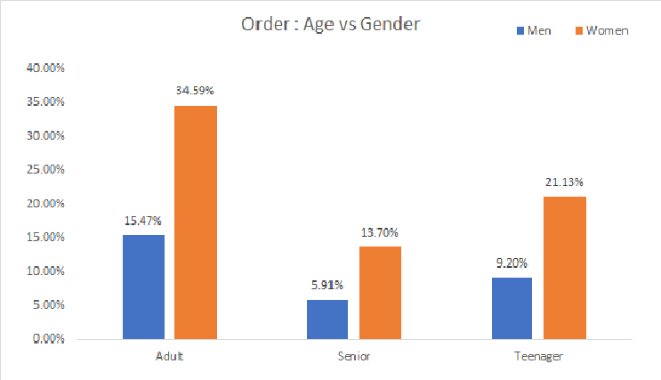
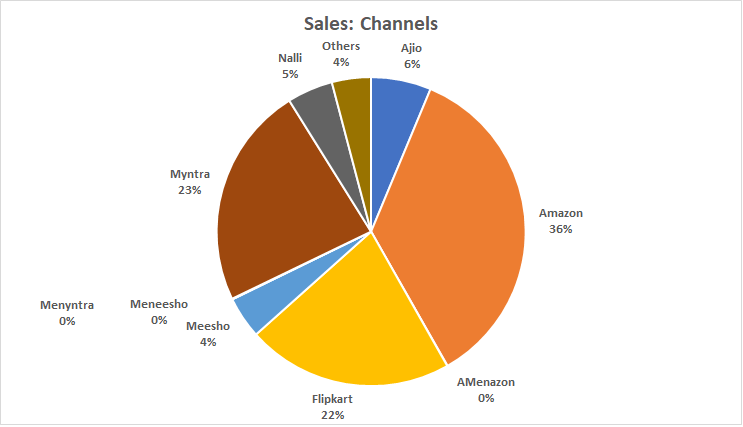

# Rama Clothes Store Annual Sales Analysis 2025

## Project Overview

**Rama Store Annual Sales Analysis** is an Excel-based data analytics project focused on understanding customer purchasing behavior, sales trends, product performance, and sales-channel performance.

The objective of this project is to analyze **2025 sales data** and generate actionable insights that can help Rama Store understand its customers, identify high-performing products and regions, and develop strategies to increase sales in **2026**.

---

## Business Objective

Rama Store wants to understand its 2025 sales performance and customer purchasing behavior.

The analysis aims to:

* Identify monthly sales and order trends
* Understand customer purchasing behavior by gender and age
* Identify top-performing states
* Analyze sales by category
* Compare different sales channels
* Understand order-status distribution
* Identify opportunities for improving sales performance in 2026

---

## Business Questions

The analysis answers the following key business questions:

1. How do **monthly sales and order volumes** compare?
2. Which month generated the **highest sales** and the **highest number of orders**?
3. Who purchased more in 2025 — **men or women**?
4. What are the different **order statuses**?
5. Which **top 10 states** contribute the most to total sales?
6. What is the relationship between **age group and gender** based on the number of orders?
7. Which **sales channel** contributes the most to total sales?
8. Which **product category** generates the highest sales?

---

## Dataset Overview

The dataset contains:

* **31,047 rows**
* **19 columns**

### Dataset Columns

| Column           | Description                    |
| ---------------- | ------------------------------ |
| Index            | Record identifier              |
| Order ID         | Unique order identifier        |
| Cust ID          | Customer identifier            |
| Gender           | Customer gender                |
| Age              | Customer age                   |
| Date             | Order date                     |
| Status           | Order status                   |
| Channel          | Sales channel                  |
| SKU              | Product identifier             |
| Category         | Product category               |
| Size             | Product size                   |
| Qty              | Quantity purchased             |
| Currency         | Transaction currency           |
| Amount           | Sales amount                   |
| Ship-City        | Shipping city                  |
| Ship-State       | Shipping state                 |
| Ship-Postal-Code | Shipping postal code           |
| Ship-Country     | Shipping country               |
| B2B              | Business-to-business indicator |

---

## Data Preparation & Cleaning

Before performing the analysis, I created a working copy of the raw dataset.

The original dataset was preserved as **Raw Data**, while the copied dataset was used for cleaning and analysis.

This approach ensures that the original dataset remains unchanged and can be referred to whenever required.

---

## Data Cleaning Process

### 1. Index

The Index column contains numeric serial values.

**Action:** No transformation required.

---

### 2. Order ID

Order ID is used to identify individual orders.

I checked the column for missing and duplicate values to ensure that order-level analysis could be performed reliably.

**Action:** Retained after validation.

---

### 3. Customer ID

Customer ID identifies customers associated with each order.

I checked for missing values because customer-level analysis depends on having a valid customer identifier.

**Action:** Validated and retained.

---

### 4. Gender Standardization

The Gender column contained multiple representations of the same categories:

```text
Women
W
Men
M
```

To avoid treating these as separate categories, the values were standardized:

```text
W → Women
M → Men
```

This ensures consistent gender-based analysis.

---

### 5. Age

Age was checked for numeric consistency and missing or invalid values.

**Action:** Validated and retained.

---

### 6. SKU

SKU identifies the product associated with an order.

The column was checked for missing values and consistency.

**Action:** Retained.

---

### 7. Status

Status represents the current order status.

The column was checked for blank or inconsistent values.

**Action:** Retained for order-status analysis.

---

### 8. Channel

Channel represents the platform through which the order was placed.

The column was validated and retained for channel-level sales analysis.

---

### 9. Category

Category represents the product category.

The values were checked for consistency and retained for category-level analysis.

---

### 10. Size

Size represents the product size associated with the order.

The column was reviewed for consistency and retained.

---

### 11. Quantity Standardization

The `Qty` column contained numerical and text representations of quantities.

For example:

```text
1
One
2
Two
```

These values were standardized into numerical values:

```text
One → 1
Two → 2
```

This allows quantity-based calculations and aggregations to be performed correctly.

---

### 12. Currency

The dataset represents transactions in the Indian market, with sales recorded in INR.

Since currency does not provide additional value for the current business questions, it was excluded from the analysis.

**Action:** Removed.

---

### 13. Amount

Amount represents the sales value of each transaction.

This is one of the most important columns in the analysis because it is used to calculate:

* Total Sales
* Monthly Sales
* State-wise Sales
* Channel-wise Sales
* Category-wise Sales

**Action:** Validated and retained.

---

### 14. Ship City

City names were standardized to uppercase to improve consistency.

Example:

```text
patna → PATNA
gaya → GAYA
delhi → DELHI
```

**Action:** Standardized to uppercase.

---

### 15. Ship State

State names were reviewed for consistency.

The values were already standardized in uppercase.

**Action:** No transformation required.

---

### 16. Ship Postal Code

Postal codes were checked for missing values and consistency.

**Action:** Validated and retained.

---

### 17. Ship Country

All transactions relate to the Indian market.

Since Ship Country is not required for the defined business questions, it was excluded.

**Action:** Removed.

---

### 18. B2B

The B2B indicator identifies business-to-business transactions.

Since B2B analysis is outside the scope of the current business questions, this column was excluded.

**Action:** Removed.

---

## Columns Removed

The following columns were removed because they were not required for the current analysis:

```text
Currency
Ship-Country
B2B
```

Removing unnecessary columns keeps the working dataset focused on the business requirements.

---

## Data Transformation / Feature Engineering

After cleaning the dataset, additional features were created to support business analysis.

### Age Group

The original `Age` column was transformed into meaningful customer segments.

### Age Group Logic

```text
Age >= 50       → Senior
Age >= 30       → Adult
Age < 30        → Teenager
```

This segmentation makes it easier to analyze purchasing behavior across different customer age groups.

### Business Use

Age Group can be used to identify:

* Which age group places the most orders
* Differences in purchasing behavior between men and women
* Customer segments that may require targeted marketing

---

## Month

A Month feature was created from the order Date.

Example Excel formula:

```excel
=TEXT(Date,"mmmmm")
```

This converts the order date into the corresponding month name.

The Month feature is used for:

* Monthly sales analysis
* Monthly order analysis
* Identifying peak sales periods
* Comparing seasonal purchasing trends

---

##  Data Analysis & Visualization

The cleaned dataset was analyzed using **Excel PivotTables, PivotCharts, formulas, and interactive filters** to answer the defined business questions.

Each analysis focuses on a specific business requirement and is supported by a corresponding visualization.

---

## 1.  Monthly Sales & Orders Analysis
Monthly sales and order data were analyzed to identify overall sales trends and understand how order volume changed throughout 2025.


This analysis helps identify peak and low-performing months and supports seasonal sales planning.

---
## 2.  Sales by Gender

Customer Sales were analyzed by gender after standardizing the original gender values.


This analysis helps identify the customer segment contributing the highest number of Sales and supports targeted marketing strategies.

---

## 3.  Order Status Analysis

The distribution of orders across different statuses was analyzed to understand order outcomes.


Understanding order-status patterns can help identify operational issues and improve order fulfillment performance.

---

## 4.  Top 5 States by Sales
State-wise sales were analyzed and ranked to identify the strongest geographic markets.


The results can help Rama Store identify high-value markets and prioritize regional marketing and sales strategies.

---

## 5.  Age Group Sales and Orders
Customers were segmented into:

* **Teenager:** Age < 30
* **Adult:** Age 30–49
* **Senior:** Age ≥ 50

Orders and Sales were then compared across age groups



This analysis helps identify customer segments with higher purchasing activity and can support more targeted campaigns.

---

## 6.  Sales Channel Analysis
Sales were compared across different sales channels to identify the channel generating the highest revenue contribution.



The analysis can help Rama Store understand which channels perform best and where additional marketing investment may generate stronger returns.

---
#  Excel Dashboard

All major analyses were combined into an interactive Excel dashboard using:

* PivotTables
* PivotCharts
* Slicers
* Filters
* KPI summaries
* Data visualization

### Dashboard Preview


The dashboard provides a consolidated view of **sales performance, customer behavior, order trends, geographic performance, and sales channels**.

---

## Key Insights
* Women customers contribute 64% of total purchases, indicating higher purchasing activity compared to men.
* Maharashtra, Karnataka, and Uttar Pradesh are the top 3 contributing states, together accounting for approximately 35% of total sales.
* Adult customers aged 30–49 years are the highest-contributing age group, contributing around 50% of total purchases.
* Amazon, Flipkart, and Myntra are the top-performing sales channels, contributing approximately 81% of total purchases.

These insights can support data-driven decisions for improving sales performance in 2026.

## Final Conclusion to Improve Sales of Rama Clothes Store in 2026
Target women customers in the Adult age group (30–49 years), particularly those from Maharashtra, Karnataka, and Uttar Pradesh. The store can increase sales by running targeted advertisements, special offers, and discount coupons on the top-performing channels — Amazon, Myntra, and Flipkart

## Tools & Technologies

* **Microsoft Excel**
* Excel Tables
* Data Cleaning
* Excel Formulas
* PivotTables
* PivotCharts
* Slicers
* Data Visualization
* Business Analysis
* Feature Engineering

---


## Key Learning Outcomes

Through this project, I practiced an end-to-end Excel data analysis workflow:

* Understanding business requirements
* Inspecting raw datasets
* Creating a working copy of data
* Data cleaning and standardization
* Handling inconsistent categorical values
* Feature engineering
* Customer segmentation
* PivotTable-based analysis
* Creating business-focused visualizations
* Extracting actionable business insights
* Converting raw data into decision-support information

---

